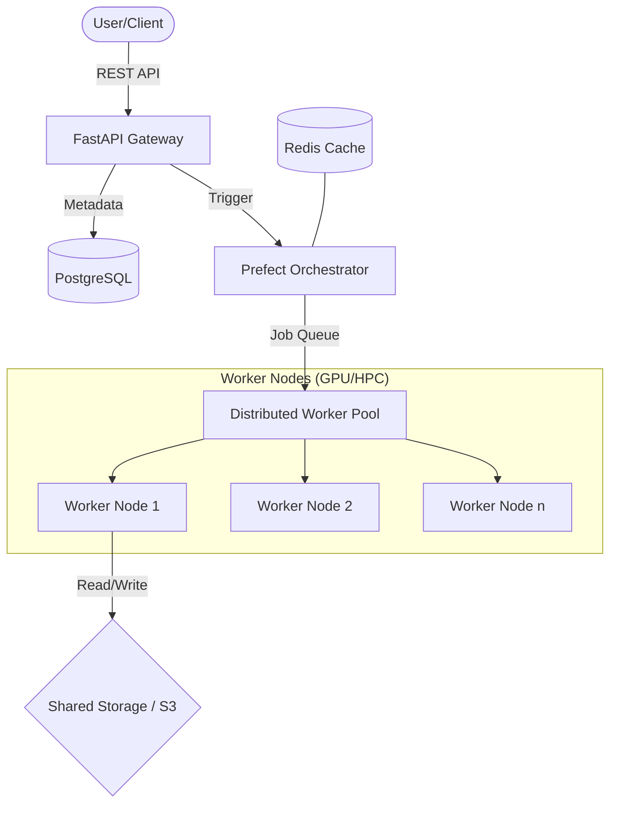
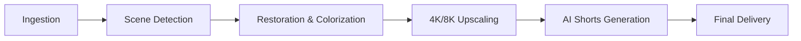

# AI Cinematic Restoration Pipeline

[](https://opensource.org/licenses/MIT)
[](https://www.python.org/downloads/)
[](https://developer.nvidia.com/cuda-toolkit)

An enterprise-grade, distributed infrastructure for high-fidelity cinematic restoration, upscaling, and automated content generation. Built for scalability on High-Performance Computing (HPC) clusters and cloud environments.

---

## 📖 Overview

The **AI Cinematic Restoration Pipeline** is a modular, distributed system designed to breathe new life into vintage or low-quality video assets. It leverages state-of-the-art deep learning models to perform temporal denoising, de-blurring, colorization, and super-resolution.

### Core Philosophy
- **Scalability**: Designed to handle massive video libraries via distributed GPU execution.
- **HPC Readiness**: Native support for Slurm workload managers.
- **Precision**: Multi-stage processing with scene-aware restoration logic.
- **Automation**: Fully automated from ingestion to social-ready "shorts" generation.

---

## 🏗 Architecture

### System Architecture


### Workflow Pipeline


---

## 🚀 Features

- **Stage-1: Ingestion**: Automated handling of multiple formats, integrity checks, and metadata extraction.
- **Scene Detection**: Intelligent frame-accurate scene splitting using `PySceneDetect`.
- **Restoration**: 
    - Scratch/Dust removal.
    - Colorization using `DeOldify`.
    - Temporal stability using `RIFE`.
- **Upscaling**: Ultra-high-resolution upscaling using `Real-ESRGAN` and `BasicVSR++`.
- **Shorts Generation**: AI-driven interest point detection to generate vertical 9:16 clips for social media.

---

## 📁 Repository Structure

```text
├── configs/              # YAML configuration files for models and environments
├── scripts/              # Utility scripts (Slurm, setup, cleanup)
├── src/
│   ├── api/              # FastAPI application and endpoints
│   ├── core/             # Configuration, logging, and shared utilities
│   ├── database/         # SQLAlchemy models and migrations
│   ├── pipeline/         # Prefect flows and restoration tasks
│   └── workers/          # Worker initialization logic
├── tests/                # Comprehensive test suite
├── Dockerfile            # Production Docker image
└── Makefile              # Development and deployment automation
```

---

## 🛠 Installation Guide

### 1. Prerequisites
- Python 3.10+
- NVIDIA GPU with 8GB+ VRAM (Recommended)
- CUDA 12.1 & cuDNN
- FFmpeg (with `nvenc` support for GPU encoding)

### 2. Setup Environment
```bash
git clone https://github.com/your-org/ai-cinematic-restoration.git
cd ai-cinematic-restoration
python -m venv venv
source venv/bin/activate
make dev
```

### 3. External Services
- **PostgreSQL**: `docker run --name restoration-db -e POSTGRES_PASSWORD=password -p 5432:5432 -d postgres`
- **Redis**: `docker run --name restoration-redis -p 6379:6379 -d redis`

---

## 🏛 HPC Deployment Guide (Slurm)

For large-scale deployments on clusters, use the provided Slurm templates:

### GPU Allocation
Submit a job using `sbatch`:
```bash
sbatch scripts/slurm_submit.sh --input /path/to/movie.mp4
```

### Distributed Execution
The pipeline uses Prefect's `ProcessTaskRunner` or `DaskTaskRunner` to distribute tasks across allocated Slurm nodes.

---

## ⚙ Configuration Guide

Configurations are managed via `configs/base.yaml` and environment variables.

| Variable | Description | Default |
|----------|-------------|---------|
| `DATABASE_URL` | PostgreSQL connection string | `postgresql://...` |
| `USE_GPU` | Enable/Disable GPU acceleration | `True` |
| `STORAGE_PATH` | Base directory for video assets | `/data` |

---

## 📖 Usage Examples

### Trigger Pipeline via CLI
```bash
make run-pipeline INPUT_FILE=movie.mp4 RESTORE_TYPE=color
```

### Trigger Pipeline via API
```bash
curl -X POST "http://localhost:8000/api/v1/restoration/start" \
     -H "Content-Type: application/json" \
     -d '{"input_path": "/data/old_movie.mp4", "upscale": true}'
```

---

## 📊 Monitoring

- **Prometheus**: Metrics exported at `:8000/metrics`.
- **Grafana**: Pre-configured dashboards for GPU utilization and pipeline throughput.
- **Logging**: Structured JSON logging for ELK/Loki integration.

---

## 🛠 Development Guide

1. **Code Style**: We use `black`, `isort`, and `flake8`.
2. **Type Checking**: Run `mypy src/` before committing.
3. **Testing**: `make test` to ensure stability.

---

## 🗺 Future Roadmap

- [ ] **AI Narration**: Synthetic voiceover for silent films.
- [ ] **Subtitles**: Automated multi-lingual captioning.
- [ ] **SEO Generation**: Metadata and description generation for YouTube/Vimeo.
- [ ] **Auto-Upload**: Integration with cloud storage and social platforms.

---

## ❓ Troubleshooting

- **CUDA Out of Memory**: Reduce `VRAM_LIMIT_GB` in `.env` or lower `batch_size`.
- **FFmpeg Errors**: Ensure `libx264` or `h264_nvenc` codecs are installed.
- **Slurm Failures**: Check `squeue` and `slurm-*.out` logs for resource allocation errors.

---

## 📜 License

Distributed under the MIT License. See `LICENSE` for more information.
